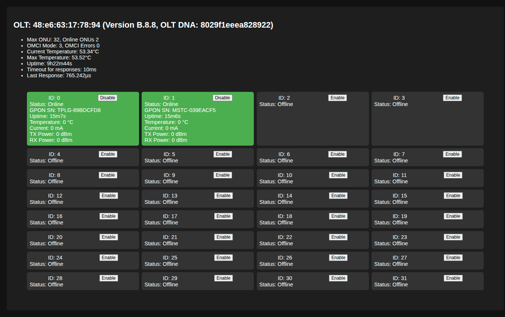

# ZH-Volt

Golang tools to maneger zh-volt(16|32|64) OLT

## Working

Currently we have few things that you can change, or visualize, the following things are possible:

- View OLT Temperature
- OMCI mode
- ONU Connection Time and OLT Uptime
- Connected ONUs
- ONU Status (Partially mapped)
- GPON SN also
